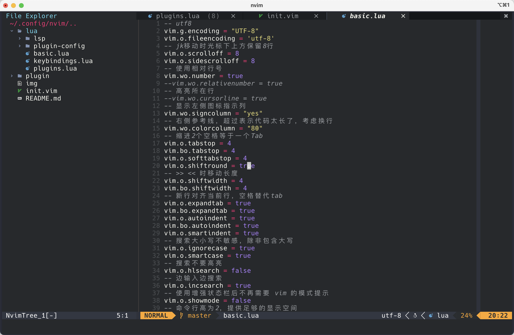
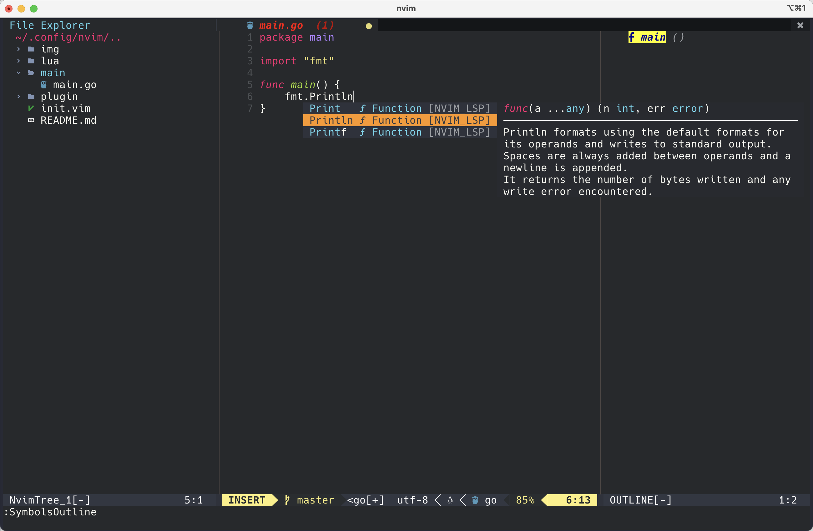
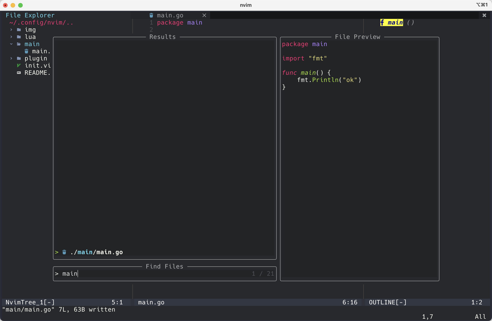

# 个人nvim开发工具配置文件

## 已配置的环境：
1. Go
2. Lua
3. Python
3. Vue
4. Markdown

## 配置快捷键一览：
|类别|执行操作|快捷键|
|---|---|---|
|Vim自带|定位到行首/行尾部|0/ shift+4|
|   |撤销/恢复之前的操作| u/ control+r |
|   |撤销和恢复这一行的操作 | shift+u   |
|   |搜索当前文件 | /搜索内容，enter, n：下一个候选值，N：上一个候选值 |
|   |快速跳转到指定行 | :行号/ 行号gg |
|   |向上翻/向下翻半页 整页|control+u/d control+b/f|
|   |缩进代码 |选择行 > < |
|   |水平/垂直分屏 |;+v/s |
|   |关闭当前分屏/其他分屏 |;+c/ o |
|   |跳转到左下上右窗口中 |;+h/ j/ k/ l |
|   |单词光标移动:下一个词结尾/上一个词结尾/下一次词开头/上一个词开头 | e/ge/w/b |
|   |来回在当前括号处跳转 | % |
|   |插入模式下使用jk退到命令模式 |jk |
|   |快速移动到下一个字符之后输入 |jkla |
|   |跳转函数定义/跳回|contron+]/ control+t|
|   |函数体之间跳转|[[/ ]]|
|   |快速选中当前段落|v+as|
|   |快速选中当前光标所在词 复制所在词 剪切所在词|v+iw yiw diw|
|   |快速选择光标小括号内的字符 |v+ab |
|   |快速剪切当前光标所在的词|normal+diw|
|   |快速复制当前光标所在的词|normal+yiw |
|   |快速剪切括号内的所有内容 |normal+di(|
|   |快速剪切双/单引号内的内容并进入insert模式|ci"/ci'|
|   |复制之前yy的内容，而不是复制dd的内容 | ;+p| 
|   |快速在匹配当前光标所在词并向上一个移动|#|
|   |快速在匹配当前光标所在词并向下一个移动|*|
|   |替换全文a为b /g不询问直接替换 /c询问选择替换 |:%s/a/b + enter :%s/a/b/g  :%s/a/b/c |
|   |格式化代码 |;+i |
|   |打开/ 折叠 |zc/ zo |
|   |打开、折叠当前括号对|za|
|   |打开/关闭所有折叠 |zR/ zM |
|nvim-tree|打开/关闭目录树 |;+n |
|   |打开或关闭文件夹，打开文件 |o |
|   |复制文件名|y |
|   |复制文件相对打开根相对路径; 复制文件绝对路径|Y; gy|
|   |光标定位到当前文件的父级别目录, 定位到当前文件的同级目录的最后一项 | P, J |
|   |创建文件/重命名文件 |a/ r |
|   |拷贝/ 剪切/ 粘贴/ 删除 |c/ x/ p/ d |
|   |显示/ 关闭隐藏文件 |H |
|   |使用系统默认应用打开所选文件 |s |
|bufferline|左/右切换tab |control+h/l |
|   |关闭左/右边全部tab |dl/dr|
|LSP系列|跳转到定义/返回,跳转到上一位置 |gd / ctrl+o ctrl+i |
|   |跳转到继承处|gi|
|   |跳转到相关处|gr|
|   |显示提示 | gh|
|   |选择第一个自动补全|enter|
|   |自动补全跳转下一个/上一个 |control+j/ k |
|   |取消/显示自动补全 |control+ ,/ . |
|   |取消当前行输入| control+u |
|   |同步修改名字|;+rn |
|telescope|全局搜索文件名 |;+ff |
|   |全局搜索字符串|;+fb|
|   |搜索打开的bufferline |;+fb |
|   |搜索帮助命令 |;+fh |
|toggleterm|启动/关闭第一个float term |control + \ |
|   |启动/关闭第n个float term |  n + control + \ |
|vim-go|启动go debug模式|:GoDebugStart  ;\<F5>|
|   |:GoDebugBreakpoint 光标所在行下断点| \<F9> |
|   |:GoDebugStep 逐行调试 | \<F10> |
|   |:GoDebugContinue 逐断点调试| \<F5> |
|   |:GoDebugStep 跳入函数体|;\<F9>|
|   |:GoDebugStepOut 跳出函数体|;\<F10>|
|   |结束debug模式| :GoDebugStop \;\<F4>|
|   |运行当前go文件|:GoRun \ \<F4>|
|symbols-outline|显示/关闭文档结构|:SymbolsOutline|
|vimspector|启动调试|\<F5>|
|   |停止调试|;\<F6>|
|   |下断点|\<F9>|
|   |下一步|\<F10>|
|   |步入函数|;\<F9>|
|   |跳出函数|;\<F10>|
|   |列表显示所有断点 删除，禁用单个，禁用所有|;<F7> dd,t,T |
|todo-comments|使用Telescope显示当前项目中所有todo-comments |;tt / :TodoTelescope |
|trouble|列出/关闭当前项目中存在的trouble|;xx / :TroubleToggle|
|gitsigns|重置当前文件和commit一致|:Gitsigns reset_buffer|
|   |定位上/下一个修改区域|;gi/ ;gj|
|   |预览当前区域的修改内容|;gv|
|Comment|行/快注释|gcc/gcb|
|   |在当前行上方/下方/末尾添加注释|gcu/gcd/gca|
|spellsitter|开启/关闭拼写检查|\sp, \nsp|


## 安装的插件:
|用途|名字|链接地址  |
|---|---|---|
|主题 | monokai.nvim|[click](https://github.com/tanvirtin/monokai.nvim) |
|目录树| nvim-tree.lua|[click](https://github.com/kyazdani42/nvim-tree.lua) |
|状态栏 | lualine.nvim|[click](https://github.com/nvim-lualine/lualine.nvim) |
|管理tabs | bufferline.nvim|[click](https://github.com/akinsho/bufferline.nvim) |
|编辑时启动终端|akinsho/toggleterm.nvim |[click](https://github.com/akinsho/toggleterm.nvim) |
|高亮显示| nvim-treesitter|[click](https://github.com/nvim-treesitter/nvim-treesitter) |
|全局搜索|nvim-telescope/telescope.nvim |[click](https://github.com/nvim-telescope/telescope.nvim) |
|lsp| nvim-lspconfig|[click](https://github.com/neovim/nvim-lspconfig) |
|   |  nvim-lsp-installer|[click](https://github.com/kabouzeid/nvim-lspinstall) |
|代码补全|  hrsh7th/nvim-cmp|[click](https://github.com/hrsh7th/nvim-cmp) |
|自动补全括号|  nvim-autopairs|[click](https://github.com/windwp/nvim-autopairs) |
|代码调试| vimspector|[click](https://github.com/puremourning/vimspector)|
|markdown预览| markdown-preview.nvim |[click](https://github.com/iamcco/markdown-preview.nvim) |
|大纲显示| symbols-outline.nvim |[click](https://github.com/simrat39/symbols-outline.nvim) |
|go语言插件| vim-go|[click](https://github.com/fatih/vim-go)
|缩进线|indent-blankline.nvim|[click](https://github.com/lukas-reineke/indent-blankline.nvim)|
|TODO高亮|todo-comments|[click](https://github.com/folke/todo-comments.nvim)|
|Trouble显示 |trouble.nvim |[click](https://github.com/folke/trouble.nvim) |
|git操作|gitsigns.nvim|[click](https://github.com/lewis6991/gitsigns.nvim)|
|注释插件|Comment.nvim|[click](https://github.com/numToStr/Comment.nvim)|
|实时颜色显示|nvim-colorizer.lua|[click](https://github.com/norcalli/nvim-colorizer.lua)|
|scrollview|nvim-scrollview|[click](https://github.com/dstein64/nvim-scrollview)|
|spell检查|spellsitter.nvim|[click](https://github.com/lewis6991/spellsitter.nvim)|


## 快速配置
1. 配置lua环境（CentOS默认安装了lua5.1）
    - mac : brew install lua
    - ubuntu : sudo apt-get install lua5.1
2. 配置node环境：[install](http://nodejs.cn/download/)
3. 配置go环境：[install](https://golang.google.cn/dl/)


### CentOS/Ubuntu/Mac
1. 安装neovim软件
    1. [Release Nvim v0.7.2 · neovim/neovim · GitHub](https://github.com/neovim/neovim/releases/tag/v0.7.2)
2. mkdir -p ~/.config && cd ~/.config
3. git clone https://github.com/yaoslivy/nvim.git
4. 安装插件
    1. 方式一：直接下载备份好的文件: 
        1. mkdir -p  ~/.local/share/nvim/site/pack && cd ~/.local/share/nvim/site/pack
        2. wget https://github.com/yaoslivy/nvim/releases/download/v0.1/packer.tar.gz
        3. tar -xzvf packer.tar.gz
    2. 方式二：逐个Install: 
        1. 安装 Packer.nvim 插件管理器 git clone --depth 1 https://github.com/wbthomason/packer.nvim ~/.local/share/nvim/site/pack/packer/start/packer.nvim
        2. 输入：nvim，然后输入:PackerInstall完成插件下载
5. 需单独clone插件：
    1. git clone https://github.com/fatih/vim-go.git ~/.local/share/nvim/site/pack/plugins/start/vim-go
    2. ripgrep: [install url](https://github.com/BurntSushi/ripgrep#installation)
    3. git clone https://github.com/puremourning/vimspector.git   ~/.local/share/nvim/site/pack/plugins/start/vimspector
6. python环境需要安装python3 -m pip install --user --upgrade pynvim，lsp安装的pyright编辑时解析的是当前终端进入nvim的python虚拟环境
7. vimspector配置:
    1. 安装语言adapter：:VimspectorInstall debugpy delve
    2. 设置.vimspector.json配置文件
    ```shell
    # linux
    cd ~/.local/share/nvim/site/pack/plugins/start/vimspector/configurations/linux
    # mac
    cd ~/.local/share/nvim/site/pack/plugins/start/vimspector/configurations/macos
    
    mkdir python go
    # 设置全局python debug配置文件
    # 需要配置python执行器的全局环境变量PYROOT
    echo "{
        \"configurations\": {
            \"debug cur python\": {
                \"adapter\": \"debugpy\",
                   \"filetypes\": [ \"python\" ],
                    \"configuration\": {
                        \"name\": \"debug python conf\",
                        \"type\": \"python\",
                        \"request\": \"launch\",
                        \"cwd\": \"\${workspaceRoot}\",
                        \"stopOnEntry\": true,
                        \"console\": \"externalTerminal\",
                        \"python\": \"\${PYROOT}/bin/python\", 
                        \"program\": \"\${file}\"
                    }
            }
        }
    }" > python/conf.json

    # 设置全局go debug配置文件
    echo "{
        \"configurations\": {
                \"debug cur go\": {
                    \"adapter\": \"delve\",
                    \"filetypes\": [ \"go\" ],
                    \"variables\": {
                    },
                    \"configuration\": {
                        \"request\": \"launch\",
                        \"program\": \"\${file}\",
                        \"mode\": \"debug\"
                    }
                }
        }
    }" > go/conf.json

    ```


报错解决：
1. [centos7升级gcc 解决make时c99错误_Telda_W的博客-CSDN博客_makefile设置c99](https://blog.csdn.net/qq_23418145/article/details/121162908)
2. vimspector need python3:
    1. 在init.vim修改python3_host_prog配置
3. error:Import "module" could not be resolved
    1. lsp中pyright问题，解决方案：
    - lsp.config.pyright.lua配置analysis.extraPaths路径，到项目目录
    - 在每个项目目录下配置pyrightconfig.json文件
    ```shell
    echo "{
        \"executionEnvironments\": [
            {\"root\": \"src\"}
        ]
    }" > pyrightconfig.json
    ```
4. error:Vetur error with finding tsconfig.json or jsconfig.json
    1. 项目目录下配置tsconfig.json
    ```shell
    echo "
    {
    \"compilerOptions\": {
        \"target\": \"esnext\",
        \"module\": \"esnext\",
        \"strict\": true,
        \"jsx\": \"preserve\",
        \"moduleResolution\": \"node\"
        }
    }
    " > tsconfig.json
    ```
5. error: symbols-outline.nvim/lua/symbols-outline/preview.lua:21: Expected Lua number
    1. 当前symbols-outline版本的包有问题，删除重新安装
6. ssh远程如何复制vim中的文本
    1. 本地需要一个支持 OSC 52 的终端，mac下iterm2中General->Selection->勾选 Applications in terminal may access clipboard
    2. chmod +x ~/.config/nvim/clipboard-provider
    3. 写入环境变量:
        ```shell
        tee -a $HOME/.zshrc <<'EOF'
        # Nvim-config envs
        export NVIMPATH=$HOME/.config/nvim/
        export PATH=$NVIMPATH:$PATH 
        EOF

        source ~/.zshrc
        ```
    4. 重启nvim，之后在VISUAL模式下就可以直接使用y复制ssh远端的内容到本地系统剪切板中了


## 效果展示



